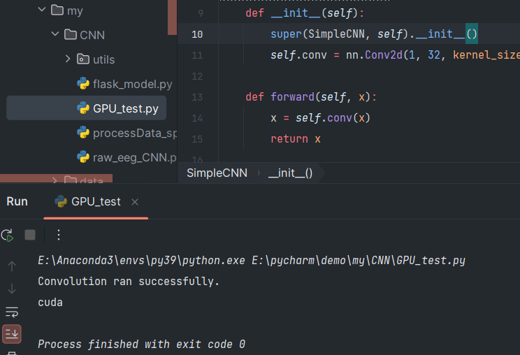

好久没有安装cuda了，今天就吧全部流程在走一遍，刚好自己也需要一个新的运行环境

```
pip --default-timeout=100 install torch==1.11.0+cu113 torchvision==0.12.0+cu113 torchaudio==0.11.0 --extra-index-url https://download.pytorch.org/whl/cu113
```
在使用上面命令前,更新镜像源
```
pip config set global.index-url https://pypi.tuna.tsinghua.edu.cn/simple

```

不过现在都不推荐使用pip来安装了，总之安装完成就行，下次试试whl安装
